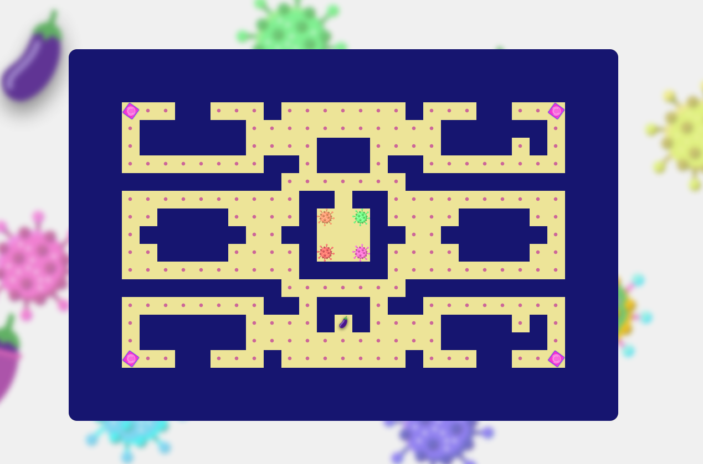

[consultez le rendu](https://ndli.rabec.eu/)

## :dart: Objectif

créer une application qui aidera [SIS ASSOCIATION](https://www.sida-info-service.org/) à informer sur le SIDA et les MST en général

##  Description

Le jeu se base sur le concept classique de Pacman, avec Puck-Man remplacé par une aubergine pour représenter l'organe reproducteur masculin de manière humoristique.

## Fonctionnalités

Le but du jeu est de manger toutes les petites boules dans le labyrinthe pour terminer un niveau. Les fantômes originaux ont été remplacés par différentes MST qui se déplacent de manière aléatoire. Si le joueur touche une MST, il perd le niveau. Le joueur peut se protéger temporairement en prenant une capote.
  
À la fin de chaque niveau, le labyrinthe disparaît et est remplacé par une question liée aux MST. Des options seront présentées au joueur et s'il trouve la bonne réponse, il pourra passer au niveau suivant.
  
Une page d'éducation est également disponible pour aider le joueur à mieux comprendre les MST et à se préparer pour répondre aux questions.

## :page_with_curl: Défis

-   AXOCapt'Challenge :
    Dans la page informations, il y a un captcha qui est utilisé pour vérifier que l'utilisateur est bien un humain. Il faut trouver la case vous protégeant des IST pour valider le captcha.

-   Le chat l'a attrapée
    Dans toutes les pages on peut naviguer uniquement avec le clavier. Les raccourcis sont affichés dans le menu principal, puis il faut appuyer sur entrée pour fermer les fenêtres modales.

-   Défi nuit de l'info 2022
    Nous avons réalisé un pacman dans le but d'avoir un outli éducatif et ludique connu de tous.
    L'idée est simple, pacman est devenu une aubergine, qui doit échapper aux MST/IST. Pour se protéger et lutter, il peut s'armer de 4 preservatifs à durée limité (pac gum).
    A chaque défaite, un message de sensibilisation aux MST/IST est affiché.
    Afin de valider un niveau, le joueur doit répondre à une question, s'il a faux, il obtient la réponse et la partie s'arrête.
